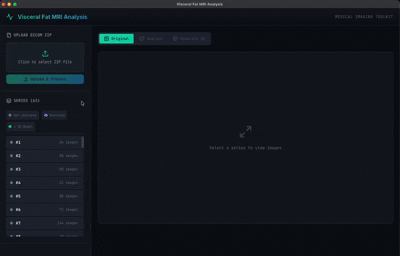

# Visceral Fat MRI Analysis

A comprehensive tool for analyzing MRI images to detect and visualize visceral fat, with color-coded tissue segmentation and 3D model generation.

## Demo



*Demo showing tissue segmentation, analysis statistics, and interactive 3D model visualization.*

## Project Structure

```
vfat/
├── backend/           # Python FastAPI backend
│   ├── app/
│   │   ├── api/       # API route handlers
│   │   ├── services/  # Business logic services
│   │   ├── models/    # Pydantic schemas
│   │   └── utils/     # Utility functions
│   ├── requirements.txt
│   ├── setup.sh       # Setup script
│   └── run.py         # Server runner
│
├── frontend/          # React TypeScript frontend
│   ├── src/
│   │   ├── components/  # React components
│   │   ├── services/    # API service
│   │   ├── stores/      # Zustand state management
│   │   └── types/       # TypeScript types
│   └── package.json
│
├── assets/            # Generated assets
│   ├── images/        # Processed images
│   ├── models/        # Generated 3D models (GLB)
│   └── dicom/         # Uploaded DICOM files
│
└── project_specs.md   # Original project specifications
```

## Features

### Backend (Python)
- **DICOM Processing**: Load and parse DICOM MRI files
- **Tissue Segmentation**: Automatic detection of:
  - Visceral fat (orange)
  - Subcutaneous fat (yellow)
  - Muscle tissue (red)
  - Organs (blue)
  - Bone (white)
- **3D Model Generation**: Create GLB models from segmented data
- **Statistics Calculation**: Volume and area measurements

### Frontend (React)
- **Original View**: Browse raw MRI slices
- **Analyzed View**: Color-coded tissue overlay with statistics
- **3D Model View**: Interactive Three.js visualization
- **Slice Navigation**: Navigate through MRI slices
- **Statistics Panel**: Real-time tissue analysis data

## Quick Start

### Backend Setup

1. Navigate to the backend directory:
   ```bash
   cd backend
   ```

2. Run the setup script (creates venv and installs dependencies):
   ```bash
   chmod +x setup.sh
   ./setup.sh
   ```

3. Activate the virtual environment:
   ```bash
   source venv/bin/activate
   ```

4. Start the server:
   ```bash
   python run.py
   ```

The API will be available at `http://localhost:8000`

API documentation at `http://localhost:8000/docs`

### Frontend Setup

1. Navigate to the frontend directory:
   ```bash
   cd frontend
   ```

2. Install dependencies:
   ```bash
   npm install
   ```

3. Start the development server:
   ```bash
   npm run dev
   ```

The frontend will be available at `http://localhost:5173`

## Usage

1. Start both the backend and frontend servers
2. Open `http://localhost:5173` in your browser
3. Upload a ZIP file containing DICOM images (see format below)
4. Select a series from the sidebar
5. Click "Analyze" to perform tissue segmentation
6. Toggle between Original, Analyzed, and 3D views
7. Click "Generate 3D" for interactive 3D visualization

## DICOM ZIP File Format

The application accepts ZIP files containing DICOM MRI images. The file structure is flexible:

### Supported Structures

```
# Simple flat structure
my_scan.zip
├── IM_0001
├── IM_0002
├── IM_0003
└── ...

# Nested folder structure (from DICOM export)
my_scan.zip
├── DICOM/
│   └── ST000001/
│       └── SE000001/
│           ├── IM000001.dcm
│           ├── IM000002.dcm
│           └── ...

# Multiple series in one ZIP
my_scan.zip
├── Series1/
│   ├── slice_001.dcm
│   └── slice_002.dcm
└── Series2/
    ├── slice_001.dcm
    └── slice_002.dcm
```

### Key Points

- **File extensions**: DICOM files can have `.dcm` extension or no extension at all - the app detects DICOM files by content
- **Folder depth**: Any nesting level is supported - all subdirectories are scanned
- **Multiple series**: If your ZIP contains multiple MRI series, they will be automatically separated based on the DICOM `SeriesInstanceUID` tag
- **Non-DICOM files**: Any non-DICOM files (like .txt, .xml, .zip) are automatically skipped
- **Ordering**: Slices are automatically ordered by the DICOM `InstanceNumber` tag

### Best Practices

1. **Use T1-weighted MRI scans** for optimal fat detection (fat appears bright on T1)
2. **Include the full abdominal region** for visceral fat analysis
3. **Ensure consistent slice spacing** for accurate 3D model generation
4. **Avoid mixing different scan types** in the same series

## API Endpoints

### DICOM
- `POST /api/dicom/upload` - Upload DICOM files
- `POST /api/dicom/load-directory` - Load from local directory
- `GET /api/dicom/series` - List available series
- `GET /api/dicom/series/{id}` - Get series info
- `GET /api/dicom/series/{id}/images` - List series images
- `GET /api/dicom/series/{id}/image/{idx}` - Get image as PNG

### Analysis
- `POST /api/analysis/analyze/{id}` - Analyze a series
- `GET /api/analysis/results/{id}` - Get analysis results
- `GET /api/analysis/results/{id}/image/{idx}` - Get analyzed image
- `GET /api/analysis/results/{id}/stats` - Get tissue statistics

### 3D Model
- `POST /api/model/generate/{id}` - Generate 3D model
- `GET /api/model/download/{id}` - Download model (GLB/OBJ)
- `GET /api/model/info/{id}` - Get model information
- `GET /api/model/slice/{id}/{idx}` - Get slice plane coordinates

## Technology Stack

### Backend
- **FastAPI** - Modern Python web framework
- **pydicom** - DICOM file handling
- **NumPy/SciPy** - Numerical processing
- **scikit-image** - Image analysis
- **trimesh** - 3D mesh generation

### Frontend
- **React 18** - UI framework
- **TypeScript** - Type safety
- **Vite** - Build tool
- **Three.js / React Three Fiber** - 3D visualization
- **Zustand** - State management
- **Axios** - HTTP client
- **Lucide React** - Icons

## Tissue Detection (Hounsfield Units)

The analysis uses CT/MRI Hounsfield Unit values for tissue classification:

| Tissue Type | HU Range |
|------------|----------|
| Fat | -190 to -30 |
| Muscle | 10 to 40 |
| Soft Tissue/Organs | 40 to 80 |
| Bone | > 300 |

## License

MIT License - See LICENSE file for details.
